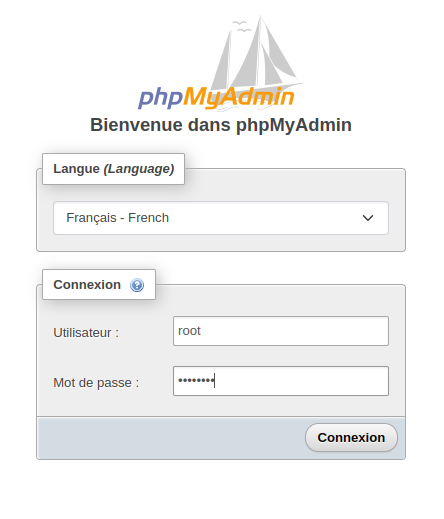
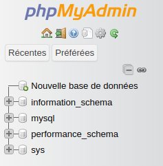
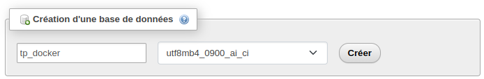
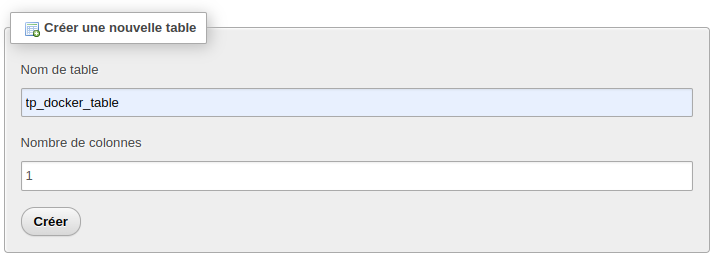
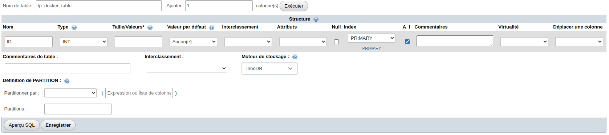
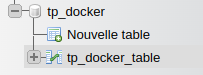

# TP Docker 2

# Executer un serveur web (apache, nginx...) dans un container docker
- Récupérer l'image sur le docker hub (httpd ou nginx)
    - `docker pull nginx`

- Utiliser un commande pour verifier que vous disposez bien de l'image en local
    - `docker image ls | grep nginx`

- Créer un fichier dans votre repo local ./html/index.html qui contient "Hello World"
    - `mkdir html`
    - `echo "Hello World" > html/index.html`

- Demarrer un nouveau container et servir la page html créée precedemment à l'aide d'une référence absolue
    - `docker run --name nginx -v /home/alexis/Ynov/B3/DevOps/devops_tp_ynov_Alexis_Provo/TP_DOCKER_1/html/:/usr/share/nginx/html -d -p 80:80 nginx`

- Supprimer le container
    - `docker stop CONTAINER_ID && docker rm CONTAINER_ID`

- Relancer le même container sans l'option -v puis utilisez la commande cp pour servir votre fichier (docker cp ARGS)
    - `docker run --name nginx -d -p 80:80 nginx`
    - `docker cp html/ dbdebc68ec13:/usr/share/nginx/`

# Builder une image
- A l'aide d'un Dockerfile, créer une image qui permet d'executer un serveur web (apache, nginx...)
    - Voir Dockerfile
    - `docker build -t nginx-dockerfile .`
- Executer cette nouvelle image de manière à servir .html/index.html
    - `docker run --name nginx-dockerfile -p 80:80 nginx-dockerfile`
- Quelles différences observez-vous entre les questions 3 et 4, trouvez les avantages & inconvénients de chaque procédure (mount volume VS copy)
    - Pour la question 3, nous devons renseigner tous les paramètres de notre image à chaque fois que nous voulons la lancer, alors que pour la question 4 la grande partie des paramètres est déjà indiqué dans le Dockerfile.
    - Lancer une image à partir d'un Dockerfile est plus simple et pratique, nous pouvons aussi renseigner des commandes à lancer dans l'image à partir du Dockerfile.
    - Il ne reste plus qu'a lancer l'image créée à partir du Dockerfile et indiquer les ports exposés

# Utiliser une base de donnée dans un container Docker
- Récuperer les images mysql (ou mariadb) et phpmyadmin depuis le Docker Hub
    - `docker pull mysql`
    - `docker pull phpmyadmin`
- Executer 2 containers à partir des images. Lancer phpmyadmin (conteneurisé et publié sur un port) et ajoutez une table via l'interface
    - `docker network create tp_docker`
    - `docker run --name mysql --network=tp_docker -e MYSQL_ROOT_PASSWORD=password -d mysql:latest`
    - `docker run --name phpmyadmin --network=tp_docker -e PMA_HOST=mysql -e PMA_PORT=3306 -d -p 8080:80 phpmyadmin:latest`
    - Se rendre sur [http://localhost:8080](http://localhost:8080) et se connecter avec l'utilisateur root et le mot de passe défini lors du lancement de l'image mysql

    - 

    - Cliquer sur `Nouvelle base de données`

    - 

    - Renseigner le nom de la nouvelle base de données, et cliquer sur `Créer`

    - 

    - Renseigner le nom de la nouvelle table, et cliquer sur `Créer`

    - 

    - Renseigner les colonnes de la table, et cliquer sur `Enregistrer`

    - 

    - On peut voir que la nouvelle base et la nouvelle table ont été créées

    - 

# Utilisation de docker-compose.yml
- Allez lire la documentation de docker-compose et essayer de décrire à quoi sert cette commande VS la commande docker run
    - La commande `docker-compose` permet de lancer plusieurs container en même temps, la où `docker run` ne peut lancer que un seul container à la fois.
    - Docker compose permet aussi de gérer les volumes, le networking et les services dans un seul fichier

- Quelle commande permet de lancer tous les containers du fichier yaml ? Quelle commande permet de les stopper ?
    - La commande `docker compose up` permet de lancer tous les containers
    - La commande `docker compose stop` permet de stopper tous les containers